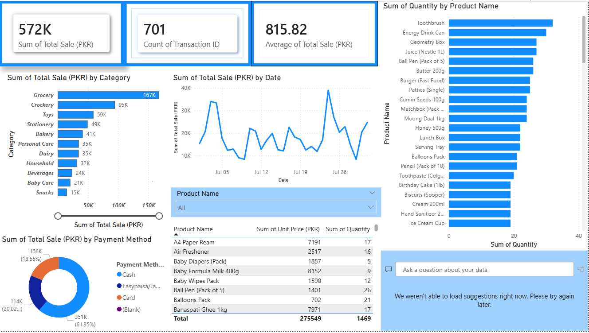
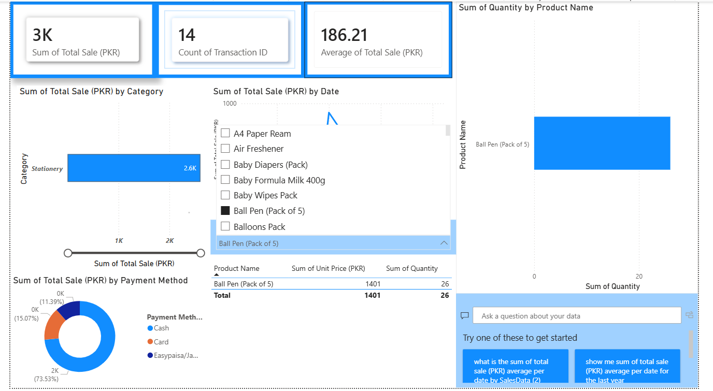
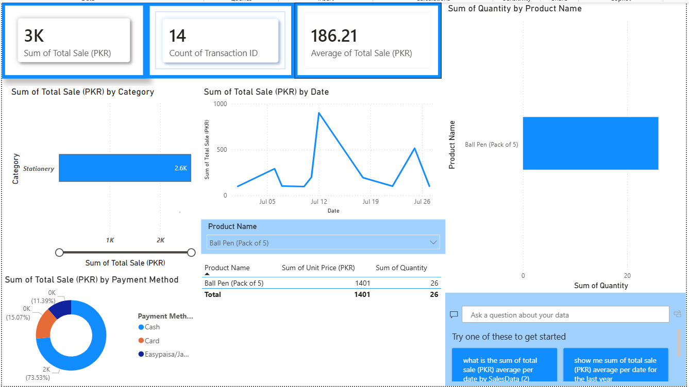
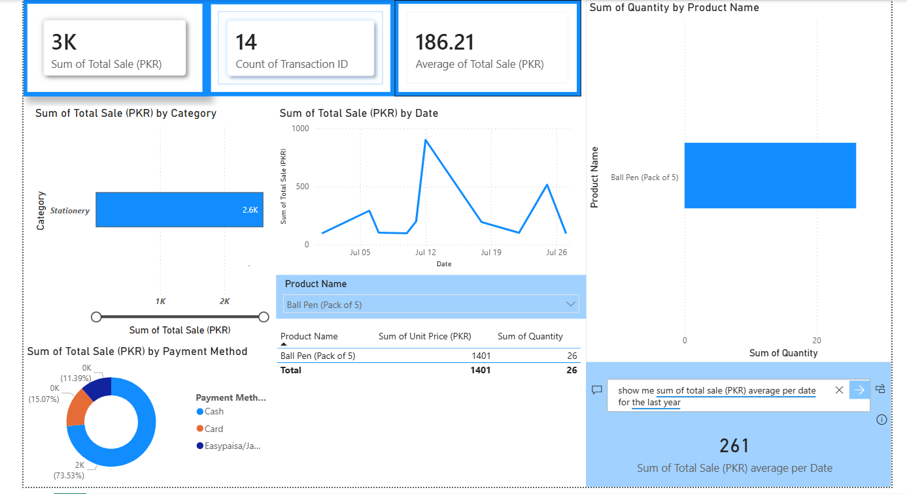
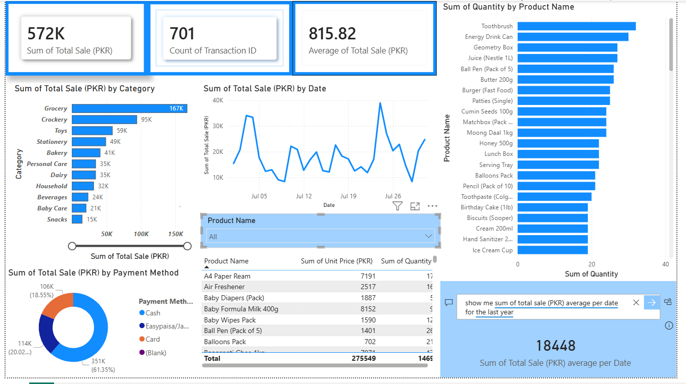

Retail Sales Dashboard — Power BI

An interactive Power BI dashboard analyzing retail sales data — built as a hands-on practice project to explore sales performance, customer payment behavior, and top-selling products.

📌 Overview

This dashboard was built using a practical sales dataset from a shopping mart in Sahiwal. It visualizes total sales, transaction volume, average sale value, category-wise performance, payment method distribution, and daily sales trends — helping turn raw transaction data into insights that support real business decisions.

🎯 Key Insights

- Grocery is the top-performing category, making up ~61% of total sales
- Cash remains the dominant payment method over card and digital wallets
- Daily sales show clear peaks and dips, useful for identifying high-demand periods
- Toothbrush, Energy Drink Can, and Geometry Box are among the top-selling products by quantity

🛠️ Tools Used

- Power BI Desktop — data modeling, DAX measures, visualizations
- Microsoft Copilot — natural language querying within Power BI

📊 Dashboard Screenshots

1. Dashboard Overview
KPIs including total sales, transaction count, and average sale value.

2. Sales by Category
Breakdown of total sales across product categories.

3. Sales Trend Over Time
Daily sales trend showing patterns and fluctuations.

4. Sales by Payment Method
Distribution of sales across cash, card, and digital wallet payments.

5. Product-Level Analysis
Top-selling products by quantity and unit price breakdown.

🚀 How to Explore

1. Download `dashboard.pbix` from this repository
2. Open it in [Power BI Desktop](https://powerbi.microsoft.com/desktop/) (free)
3. Interact with filters, slicers, and visuals to explore the data yourself

📂 Repository Structure

Retail_Sales_Dashboard_PowerBI/
├── README.md
├── dashboard.pbix
└── screenshots/
    ├── Dashboard_1.png
    ├── Dashboard_2.png
    ├── Dashboard_3.png
    ├── Dashboard_4.png
    └── Dashboard_5.png

📬 Connect

Feel free to reach out if you'd like to discuss this project or connect on LinkedIn!
